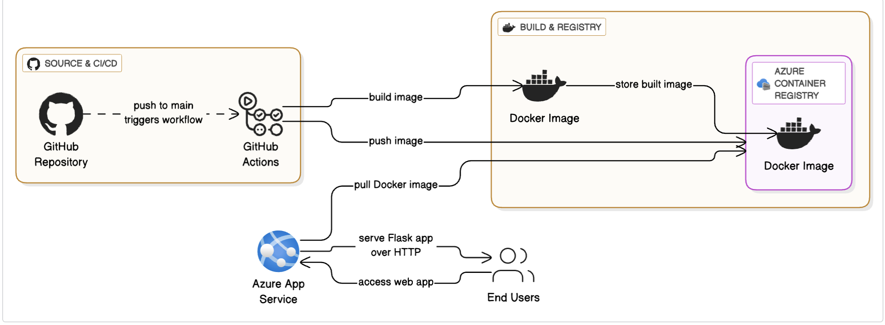

# ☕ BIG MO's Coffee Shop App 🚀

A simple, interactive coffee ordering web application built with Python Flask, Dockerized, and deployed to Azure App Service using GitHub Actions for Continuous Integration and Continuous Deployment (CI/CD).


---

## ✨ Introduction

Welcome to the GitHub repository for **BIG MO's Coffee Shop App!** This project serves as a practical demonstration of building a basic web application using Python Flask, packaging it into a Docker container, and automating its deployment to Microsoft Azure's App Service using GitHub Actions.

Initially conceived as a simple console-based interactive script, this project has evolved to showcase how to adapt a command-line application into a web-accessible service, providing a hands-on example of a modern CI/CD pipeline. It's an ideal starting point for anyone looking to understand:

* Basic Python web development with Flask.
* Containerization using Docker.
* Automated build and deployment workflows with GitHub Actions.
* Cloud deployment to Azure App Service for Containers.

## 🌟 Key Features

* **Interactive Coffee Menu:** Displays a list of available coffee items and their prices.
* **Session-Based Basket:** Users can add multiple items and quantities to a temporary shopping basket that persists for their browser session.
* **Item Removal:** Ability to remove specific items from the basket.
* **Total Cost Calculation:** Calculates the grand total for all items in the basket.
* **Web-Based Interface:** Powered by Flask, accessible via any web browser.
* **Dockerized Application:** Packaged into a lightweight Docker image for consistent environments and easy deployment.
* **Automated CI/CD:**
    * **Continuous Integration:** Every push to the `main` branch automatically triggers a build of the Docker image.
    * **Continuous Deployment:** The newly built image is automatically pushed to Azure Container Registry and deployed to Azure App Service.
* **Cloud Deployment:** Hosted on Azure App Service for Containers, providing a scalable and managed environment.

## 🏗️ Project Structure

The repository is structured as follows:

## 🚀 Getting Started (Local Development)

To run and test the Coffee Shop App on your local machine:

### Prerequisites

* Python 3.8+
* Git
* Docker Desktop (for running the Dockerized version)
* `pip` (Python package installer)

### 1. Clone the Repository

```bash
  git clone https://github.com/Maurice1909/Flask-Coffee-Shop-Dockerized-to-Azure.git
```
### 2. Set up a virtual environment in Python
```python3 -m venv venv
# On macOS/Linux: source venv/bin/activate

# On Windows (Command Prompt): venv\Scripts\activate.bat
```

### 3. Install Dependencies

```bash
pip install -r requirements.txt
```

### 4.Run flask app locally

```bash
python app.py
# Set a different port if 5000 is in use
```
Open your web browser and navigate to http://127.0.0.1:5000/ (or the port you specified).


### 5.Run the Dockerized app locally (Optional)

#Build the Docker image

```bash
#Build the Docker image
docker build -t bigmo-coffee-app .

# Run the Docker container, mapping host port 8000 to container port 8000 (as exposed by Gunicorn)
docker run -p 8000:8000 bigmo-coffee-app
```

Open your web browser and navigate to http://localhost:8000/

